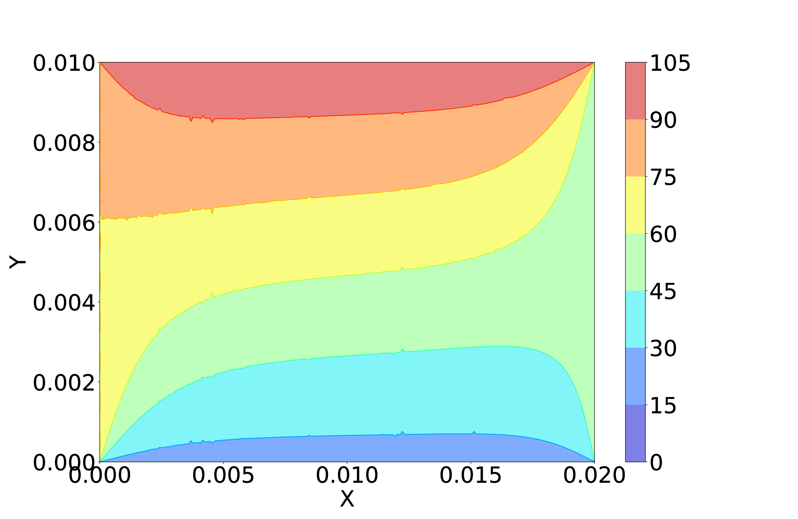
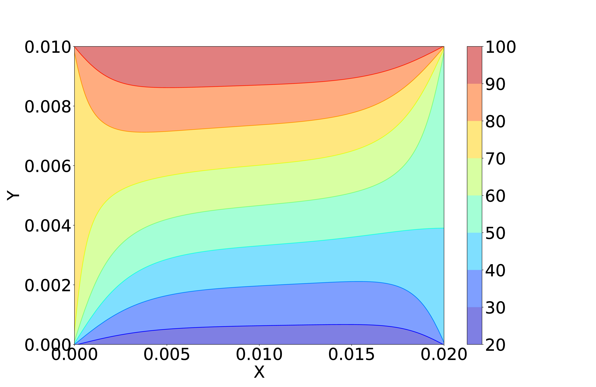
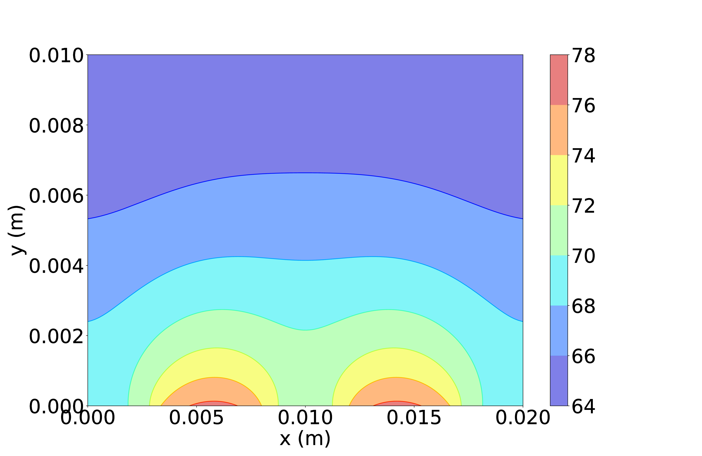

# Finite Volume Method - 2D

## Table of contents

* [General info](#general-info)
* [Expected Results](expected-results)
* [References](#references)

## General Info

That is the result of the project for the computational fluid dynamics discipline in a master's program. The project aimed to model the lid-driven cavity, and the heat conduction on plate problems, using the finite volume method. Due to the limited time, one used Python to implement the numerical solutions. However, they have a relatively good performance. Furthermore, one tried to build the codes to be comprehensible, but for any problem, feel free to contact me (almeriopamplona@gmail.com).

I did some validations that I compiled in these papers: <a href="Reports/LidCavity_AlmerioPamplona.pdf">Lid-driven Cavity</a> and <a href="Reports/2DHeatTransfer_AlmerioPamplona.pdf">2D Heat Transfer</a>.

## Expected Results

### Lid-driven cavity

One ran simulations for six Reynolds numbers: 100, 400, 1000, 3200, 7500, and 10000. These are the same cases that Ghia (1982) investigated in his paper and were used to validate the code. Additionally, one used mainly a 128 x 128 staggered grid. For Re = 100, 400, and 1000, one used a time step equal to 1E-5 s and a final time equal to 30 s. For the other three Reynolds numbers,  one used a time step equal to 2E-4 s and final time equal to 660 s. The streamlines with the velocity field as the backgroud are in the following figures:

<table>
  <tr>
      <td>Re = 100</td>
      <td>Re = 400</td>
      <td>Re = 1000</td>
  </tr>
  <tr>  
    <td></td>
    <td></td>
    <td></td>
  </tr>
  <tr>
      <td>Re = 3200</td>
      <td>Re = 7500</td>
      <td>Re = 10000</td>
  </tr>
  <tr>  
    <td></td>
    <td></td>
    <td></td>
  </tr>
</table>

Time evolution is given by the following gif, which represents a 10x10 grid containing a flow with Re = 1000:

### Heat transfer on a plate

First, one ran a simple Dirichlet problem on a plate with four different temperatures on the boundaries: 25 ºC on the south, 75 ºC on the east, 100 º C on the north, and 50 º C on the west. The grid was structured and uniform and had 256 x 256 cells. The time step was 1E-4 s, the final time was 60 s, the diffusivity was 3.94E-6 m²/s, the initial temperature was 0º C, and the plate dimensions were 0.02 m in length by 0.01 m in height. The following figures show the analytical result and the numerical one:

<table>
  <tr>
      <td>Analytical</td>
      <td>Numerical - FVM</td>
  </tr>
  <tr>  
    <td></td>
    <td></td>
  </tr>
</table>
  
Then, the actual problem was a plate immersed in the environment with convection. The external temperature was 30 ºC, and the air had a convection constant of 20 W/m² K. Furthermore, the solid had dimensions and diffusivity equal to the earlier one. The conductivity was 14.9 W / m K, and there were two heat sources with 5E+4 W/m². The simulation result is presented in the figure below.

## References

### Lid-driven cavity

Agarwal, R.K., 1981. A third-order-accurate upwind scheme for navier-stokes solutions at high reynolds numbers. AIAA.

Ghia, U., Ghia, K.N., Shin, C.T., 1982. High-re solutions for incompressible flow using the navier-stokes equations and a multigrid method*. Journal of Computational Physics 48, 387–411.

LeVeque, R.J., 2007. Finite difference methods for ordinary and partial differential equations: Steady-state and time-dependent problems. Society for Industrial and Applied Mathematics, Philadelphia.

Morton, K.W., Mayers, D., 2005. Numerical solution of partial differential equations: An introduction. 2 ed., Cambridge University Press, Cambridge. Nallasamy, M., Prasad, K.K., 1977. On cavity flow at high reynolds numbers. J. Fluid Mech 79, 391–414.

### Heat transfer

Hirsch, C., 2007. Numerical computation of internal and external flows. 2 ed., Elservier, London.

Iserles, A., 2007. A first course in the numerical analysis of differential equations. 2009 ed., Cambridge University Press, Cambridge.

LeVeque, R.J., 2007. Finite difference methods for ordinary and partial differential equations: Steady-state and time-dependent problems. Society for Industrial and Applied Mathematics, Philadelphia.

Morton, K.W., Mayers, D., 2005. Numerical solution of partial differential equations: An introduction. 2 ed., Cambridge University Press, Cambridge.

Moukalled, F., Mangani, L., Darwish, M., 2016. The finite volume method in computational fluid dynamics: An Advanced Introduction with OpenFoam and Matlab. Springer.

Patankar, S.V., 1980. Numerical heat transfer anad fluid flow. Tatlor and Francis.

Versteeg, H.K., Malalasekera, W., 2007. An introduction to computational fluid dynamics: The finite volume method. 2 ed., Pearso Education Limited, Edinburgh.

