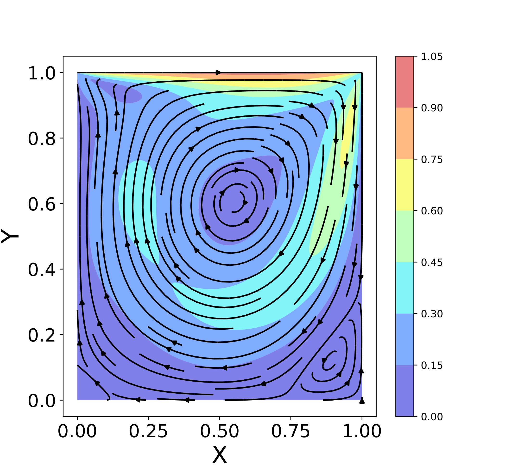

# Finite Volume Method - 2D

## Table of contents

* [General info](#general-info)
* [Expected Results](expected-results)
* [References](#references)

## General Info

That is the result of the project for the computational fluid dynamics discipline in a master's program. The project aimed to model the lid-driven cavity, and the heat conduction on plate problems, using the finite volume method. Due to the limited time, one used Python to implement the numerical solutions. However, they have a relatively good performance. Furthermore, one tried to build the codes to be comprehensible, but for any problem, feel free to contact me (almeriopamplona@gmail.com).

I did some validations that I compiled in these papers: <a href="Reports/LidCavity_AlmerioPamplona.pdf">Lid-driven Cavity</a> and <a href="Reports/2DHeatTransfer_AlmerioPamplona.pdf">2D Heat Transfer</a>.

## Expected Results

### Lid-driven cavity

One run simulations for six Reynolds numbers: 100, 400, 1000, 3200, 7500, and 10000. These are the same cases that Ghia (1982) investigated in his paper and were used to validate the code. Additionally, one used mainly a 128 x 128 staggered grid. For Re = 100, 400, and 1000, one used a time step equal to 1E-5 s and a final time equal to 30 s. For the other three Reynolds numbers,  one used a time step equal to 2E-4 and final time equal to 660 s. The streamlines with the velocity field as the backgroud are in the following figures:

<table>
  <tr>
      <td>Re = 100</td>
      <td>Re = 400</td>
      <td>Re = 1000</td>
  </tr>
  <tr>  
    <td></td>
    <td></td>
    <td></td>
  </td>
   <tr>
      <td>Re = 3200</td>
      <td>Re = 7500</td>
      <td>Re = 10000</td>
  </tr>
  <tr>  
    <td></td>
    <td></td>
    <td></td>
  </td>
</table>

Time evolution is given by the following gif, which represents a 10x10 grid containing a flow with Re = 100::

## References
